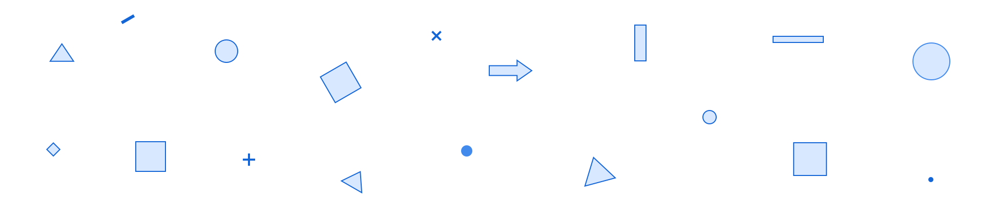

## Overview

Core iOS Application Architecture - The development paradigm of clean, testable code, modular iOS applications.

## Contents

* [Requirements]
* [Usage]
  + [Project]
  + [Module]
  + [Service]
  + [Coordinator]
* [Code Style]
* [Installation]

## Requirements

* Xcode 10+
* Swift 4.2+

### Example project

## Usage

 
 
 

 

### Project Templates
